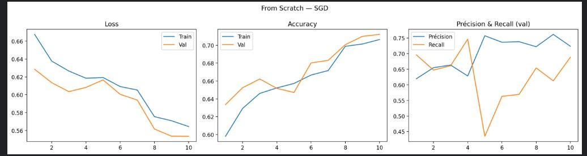
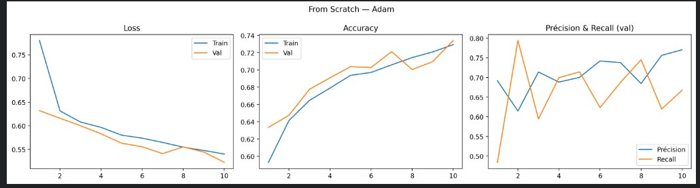
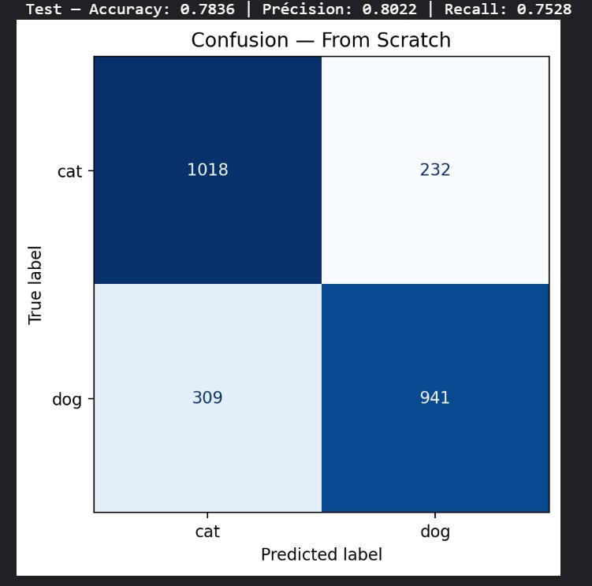
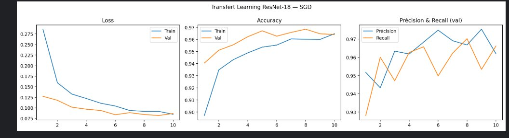
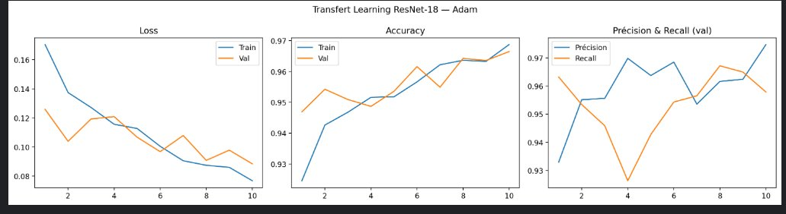
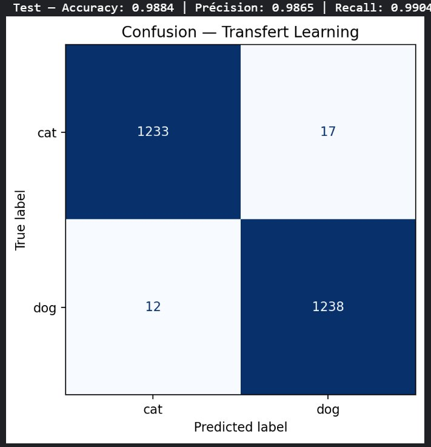
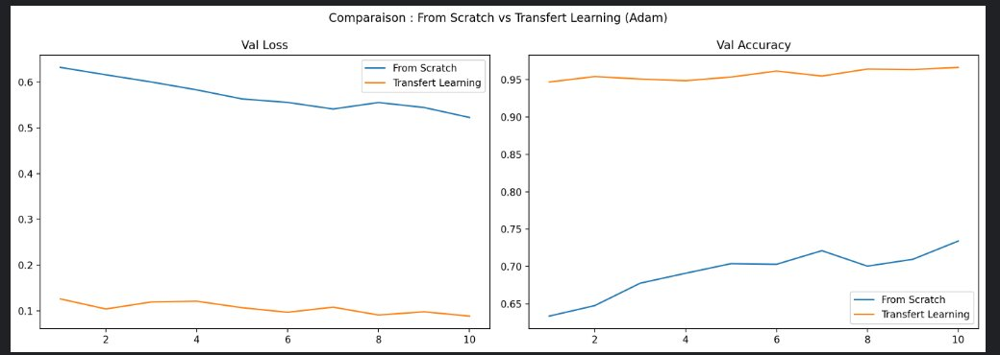

# CNN Cats vs Dogs — From Scratch vs Transfert Learning

## Objectif

Comparer **un modèle CNN entraîné from scratch** et **un modèle en transfert d'apprentissage** (ResNet-18) sur le jeu de données Cats vs Dogs. Montrer l'impact du transfert learning sur la convergence, la performance et la robustesse.

---

## Environnement

```bash
pip install -r requirements.txt
```

`requirements.txt` :
```
torch>=2.0
torchvision>=0.15
matplotlib
numpy
scikit-learn
```

---

## Note sur l'environnement d'exécution

L'entraînement a été initialement tenté sur **Google Colab** (GPU T4), mais les limites de quota GPU gratuites ont rendu l'exécution complète impossible — les sessions se déconnectaient régulièrement et le quota était épuisé avant la fin des entraînements. Le notebook a finalement été exécuté sur **Kaggle** (GPU P100 gratuit, 30h/semaine), qui s'est avéré plus stable et sans interruption.

---

## Organisation des données

Télécharger le dataset depuis [Kaggle – Dogs vs. Cats](https://www.kaggle.com/c/dogs-vs-cats/data) et placer dans le répertoire de travail :

```
Cat_Dog_data/
    train/
        cat/
        dog/
    test/
        cat/
        dog/
```

> **Note importante :** L'architecture des dossiers sur Kaggle est différente de celle utilisée pour ce devoir. Sur Kaggle, les images train sont mélangées dans un seul dossier `train/` avec les noms de fichiers comme `cat.0.jpg`, `dog.0.jpg`. Il faut donc réorganiser manuellement les images dans la structure ci-dessus (dossiers `cat/` et `dog/` séparés) avant de pouvoir utiliser `ImageFolder` de torchvision.

> Les données ne sont **pas** sur GitHub (`.gitignore`).

---

## GPU

Entraînement effectué sur **GPU NVIDIA T4 x2** (Kaggle). Vérification dans le notebook :

```python
device = torch.device('cuda' if torch.cuda.is_available() else 'cpu')
print(f'Device utilisé : {device}')  # cuda
```

---

## Commandes pour entraîner

### Expérience A — CNN From Scratch

- Architecture : 3 blocs Conv → BatchNorm → ReLU → MaxPool + classifieur FC
- **Batch Normalization** après chaque convolution : stabilise l'entraînement, réduit la sensibilité au learning rate
- **Dropout(0.5)** dans le classifieur : régularisation pour éviter le surapprentissage
- Batch size : 32 | Epochs : 10 | Weight decay : 1e-4

**SGD** : lr=0.001, momentum=0.9, scheduler StepLR(step=7, γ=0.1)

**Adam** : lr=1e-4, scheduler CosineAnnealingLR(T_max=10)

### Expérience B — Transfert Learning (ResNet-18)

- Base : ResNet-18 pré-entraîné ImageNet, **fine-tuning complet**
- Tête remplacée : Dropout(0.4) + Linear(512 → 2)
- Batch size : 32 | Epochs : 10

**SGD** : backbone lr=1e-3, tête lr=1e-2, scheduler StepLR(step=7, γ=0.1)

**Adam** : backbone lr=1e-4, tête lr=1e-3, scheduler CosineAnnealingLR(T_max=10)

---

## Commandes pour évaluer / recharger le modèle

```python
# From Scratch — meilleur modèle Adam
best_scratch = CatDogCNN(dropout_p=0.5).to(device)
best_scratch.load_state_dict(torch.load('best_scratch_adam.pth', map_location=device))
_, test_acc, test_prec, test_rec, _, _ = evaluate(best_scratch, testloader, criterion)

# Transfert Learning — meilleur modèle Adam
best_tl = build_resnet18().to(device)
best_tl.load_state_dict(torch.load('best_tl_adam.pth', map_location=device))
_, test_acc, test_prec, test_rec, _, _ = evaluate(best_tl, testloader, criterion)
```

> Les fichiers `.pth` sont locaux et exclus du dépôt via `.gitignore`.

---

## Résultats

### Tableau comparatif complet

#### Expérience A — From Scratch

| Époque | Train Loss | Train Acc | Val Loss | Val Acc | Précision | Recall |
|--------|-----------|-----------|----------|---------|-----------|--------|
| 01 | 0.6676 | 0.5980 | 0.6285 | 0.6336 | 0.6194 | 0.6961 |
| 02 | 0.6376 | 0.6292 | 0.6135 | 0.6524 | 0.6548 | 0.6473 |
| 03 | 0.6266 | 0.6461 | 0.6035 | 0.6622 | 0.6634 | 0.6610 |
| 04 | 0.6185 | 0.6522 | 0.6082 | 0.6518 | 0.6283 | 0.7462 |
| 05 | 0.6193 | 0.6572 | 0.6166 | 0.6471 | 0.7573 | 0.4348 |
| 06 | 0.6092 | 0.6667 | 0.6005 | 0.6802 | 0.7365 | 0.5630 |
| 07 | 0.6053 | 0.6717 | 0.5940 | 0.6831 | 0.7382 | 0.5692 |
| 08 | 0.5755 | 0.6988 | 0.5616 | 0.7007 | 0.7222 | 0.6539 |
| 09 | 0.5709 | 0.7014 | 0.5536 | 0.7100 | 0.7617 | 0.6127 |
| 10 | 0.5644 | 0.7064 | 0.5535 | 0.7122 | 0.7235 | 0.6886 |

**SGD — Meilleure Val Acc : 71.22%**

| Époque | Train Loss | Train Acc | Val Loss | Val Acc | Précision | Recall |
|--------|-----------|-----------|----------|---------|-----------|--------|
| 01 | 0.7803 | 0.5932 | 0.6319 | 0.6336 | 0.6918 | 0.4840 |
| 02 | 0.6313 | 0.6416 | 0.6157 | 0.6476 | 0.6147 | 0.7941 |
| 03 | 0.6077 | 0.6648 | 0.6000 | 0.6776 | 0.7139 | 0.5945 |
| 04 | 0.5965 | 0.6791 | 0.5827 | 0.6909 | 0.6883 | 0.6996 |
| 05 | 0.5800 | 0.6937 | 0.5630 | 0.7038 | 0.7003 | 0.7143 |
| 06 | 0.5737 | 0.6971 | 0.5554 | 0.7029 | 0.7422 | 0.6233 |
| 07 | 0.5646 | 0.7058 | 0.5410 | 0.7211 | 0.7377 | 0.6877 |
| 08 | 0.5546 | 0.7143 | 0.5551 | 0.7004 | 0.6846 | 0.7453 |
| 09 | 0.5476 | 0.7208 | 0.5443 | 0.7096 | 0.7564 | 0.6198 |
| 10 | 0.5401 | 0.7293 | 0.5225 | 0.7340 | 0.7706 | 0.6677 |

**Adam — Meilleure Val Acc : 73.40%**

#### Expérience B — Transfert Learning (ResNet-18)

| Époque | Train Loss | Train Acc | Val Loss | Val Acc | Précision | Recall |
|--------|-----------|-----------|----------|---------|-----------|--------|
| 01 | 0.2863 | 0.8972 | 0.1275 | 0.9404 | 0.9518 | 0.9281 |
| 02 | 0.1595 | 0.9348 | 0.1180 | 0.9511 | 0.9433 | 0.9601 |
| 03 | 0.1328 | 0.9433 | 0.1017 | 0.9556 | 0.9634 | 0.9472 |
| 04 | 0.1222 | 0.9489 | 0.0969 | 0.9622 | 0.9619 | 0.9627 |
| 05 | 0.1111 | 0.9536 | 0.0938 | 0.9671 | 0.9684 | 0.9658 |
| 06 | 0.1045 | 0.9553 | 0.0838 | 0.9627 | 0.9750 | 0.9499 |
| 07 | 0.0938 | 0.9604 | 0.0887 | 0.9658 | 0.9692 | 0.9623 |
| 08 | 0.0918 | 0.9602 | 0.0843 | 0.9684 | 0.9668 | 0.9703 |
| 09 | 0.0917 | 0.9600 | 0.0820 | 0.9647 | 0.9755 | 0.9534 |
| 10 | 0.0848 | 0.9647 | 0.0866 | 0.9640 | 0.9620 | 0.9663 |

**SGD — Meilleure Val Acc : 96.84%**

| Époque | Train Loss | Train Acc | Val Loss | Val Acc | Précision | Recall |
|--------|-----------|-----------|----------|---------|-----------|--------|
| 01 | 0.1705 | 0.9246 | 0.1260 | 0.9469 | 0.9330 | 0.9632 |
| 02 | 0.1375 | 0.9426 | 0.1040 | 0.9542 | 0.9551 | 0.9534 |
| 03 | 0.1272 | 0.9468 | 0.1193 | 0.9509 | 0.9556 | 0.9459 |
| 04 | 0.1157 | 0.9516 | 0.1210 | 0.9487 | 0.9698 | 0.9264 |
| 05 | 0.1128 | 0.9518 | 0.1068 | 0.9536 | 0.9637 | 0.9428 |
| 06 | 0.1005 | 0.9566 | 0.0968 | 0.9616 | 0.9685 | 0.9543 |
| 07 | 0.0906 | 0.9622 | 0.1080 | 0.9549 | 0.9536 | 0.9565 |
| 08 | 0.0875 | 0.9636 | 0.0909 | 0.9642 | 0.9616 | 0.9672 |
| 09 | 0.0861 | 0.9633 | 0.0979 | 0.9636 | 0.9624 | 0.9650 |
| 10 | 0.0769 | 0.9687 | 0.0885 | 0.9664 | 0.9747 | 0.9579 |

**Adam — Meilleure Val Acc : 96.64%**

### Résumé final

| Modèle | Optimiseur | Meilleure Val Acc | Test Acc | Test Précision | Test Recall |
|--------|-----------|-------------------|----------|----------------|-------------|
| From Scratch | SGD | 71.22% | — | — | — |
| From Scratch | Adam | 73.40% | **78.36%** | 80.22% | 75.28% |
| ResNet-18 TL | SGD | 96.84% | — | — | — |
| ResNet-18 TL | Adam | 96.64% | **98.84%** | 98.65% | 99.04% |

---

## Courbes

### Expérience A — From Scratch SGD



### Expérience A — From Scratch Adam



### Matrice de confusion — From Scratch



### Expérience B — Transfert Learning SGD



### Expérience B — Transfert Learning Adam



### Matrice de confusion — Transfert Learning



### Comparaison From Scratch vs Transfert Learning (Adam)



---

## Analyse

**Convergence :** Le transfert learning atteint 94% de validation accuracy dès la première époque, contre seulement 63% pour le CNN from scratch. Cette différence spectaculaire s'explique par les features déjà apprises sur ImageNet — bords, textures, formes — directement réutilisables pour distinguer chats et chiens. Le from scratch nécessite bien plus d'époques pour extraire des représentations pertinentes depuis zéro, comme le montre clairement le graphique de comparaison.

**Performance :** L'écart de plus de 20 points d'accuracy entre les deux approches (78% vs 98%) illustre la puissance du transfert learning sur des datasets de taille modérée. Les matrices de confusion confirment cette différence : le from scratch confond encore 232 chats et 309 chiens, tandis que le transfert learning n'en rate que 17 chats et 12 chiens sur 2500 images. Le CNN from scratch, malgré la data augmentation et la régularisation (Dropout + BatchNorm), reste limité par la taille du dataset.

**Optimiseurs :** Pour le from scratch, Adam (73.40%) converge plus vite que SGD (71.22%) grâce à son adaptation automatique du learning rate. Pour le transfert learning, SGD (96.84%) dépasse légèrement Adam (96.64%) sur la validation, mais les performances sur le test final sont très proches (~99%). Le learning rate différencié (backbone faible, tête haute) s'est révélé crucial en transfert learning pour préserver les features pré-apprises tout en adaptant la tête de classification.

---

## Limites & pistes d'amélioration

- Augmenter le nombre d'époques (20+) pour le from scratch afin d'améliorer la convergence.
- Tester des architectures plus légères (MobileNetV3, EfficientNet-B0) pour comparer le ratio performance/paramètres.
- Ajouter du test-time augmentation (TTA) pour améliorer la robustesse en inférence.
- Explorer le gel progressif des couches du transfert learning (layer-wise unfreezing).
- Les limites de GPU gratuites (Colab) ont contraint à réduire le nombre d'époques à 10 au lieu de 20 — de meilleurs résultats seraient attendus avec plus de temps d'entraînement.
